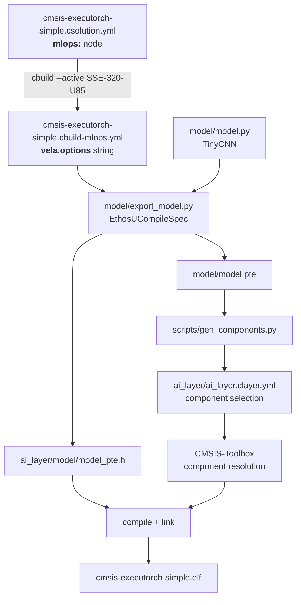

# The MLOps flow

The `mlops:` node in `cmsis-executorch-simple.csolution.yml` is the central
definition of the Ethos-U target for this example. It follows the CMSIS-Toolbox
[MLOps information](https://open-cmsis-pack.github.io/cmsis-toolbox/build-overview/#mlops-information)
specification. This document explains how the build process uses and propagates
that information, including two build-scheduling decisions that are not
apparent from the YAML alone.



## 1. The csolution declares the Ethos-U target

The `cmsis-executorch-simple.csolution.yml` file defines the Ethos-U parameters and location/name for generating the ML model.
It is the central place where the NPU parameters are specified.

```yaml
csolution:
  mlops:
    description: TinyCNN int8 image classifier for Ethos-U85
    npu:
      type: Ethos-U85
    vela:
      system: Ethos_U85_SYS_DRAM_Mid   # system-config from the Vela config
      memory: Shared_Sram              # memory-mode from the Vela config
    model:
      clayer: $AI-Layer$
      name: TinyCNN
    simulator:
      target: SSE-320-U85
```

## 2. CMSIS-Toolbox emits `*.cbuild-mlops.yml`

The `cbuild` command with the option `--active SSE-320-U85` generates the file  `cmsis-executorch-simple.cbuild-mlops.yml`, which contains the Vela command line options:

```
--accelerator-config ethos-u85-256 --system-config Ethos_U85_SYS_DRAM_Mid --memory-mode Shared_Sram
```

## 3. `export_model.py` consumes `*.cbuild-mlops.yml`

The `export_model.py` script reads `vela.options` from the generated YAML file
and passes the options to ExecuTorch's `EthosUCompileSpec`. The Python
implementation therefore contains no hard-coded NPU configuration. Changes to
the target in the csolution take effect during the next build.

The script then quantizes the model, lowers its computation graph to the
Ethos-U delegate, and generates two artifacts:

- `model/model.pte` — the serialized ExecuTorch program
- `ai_layer/model/model_pte.h` — a C array representation of the program for
  inclusion in the firmware

## 4. `gen_components.py` narrows the link

Because the pack is a *source* pack, every ExecuTorch operator is a separate
CMSIS component. `scripts/gen_components.py` reads the freshly exported `.pte`,
determines which operators it actually references, and writes
`ai_layer/ai_layer.clayer.yml` with exactly that component selection.

For a fully delegated model this is a very short list: the runtime, the Ethos-U
backend, and the int8 boundary quant/dequant kernels. Everything else is never
compiled, let alone linked.

## Two scheduling decisions worth knowing

### Why `model_pte.h` is listed as a project source

In `cmsis-executorch-simple.cproject.yml`:

```yaml
groups:
  - group: App
    files:
      - file: ./src/app_main.cpp
      - file: ./ai_layer/model/model_pte.h
```

That header is generated, so listing it as a source looks redundant — but it is
what makes the ordering correct. CMSIS-Toolbox treats a file in a `groups:`
node as a build *input*, and therefore schedules the `executes:` step that
produces it **before** compilation. Remove the line and `convert-model`
degrades to a post-build step, so the firmware links against whatever
`model_pte.h` was left over from the previous build.

### Why the clayer cannot update in place

The component selection is consumed at **configure** time — CMSIS-Toolbox
resolves components and generates the build tree before ninja runs a single
command. The `convert-model` step runs *during* the build, so by the time it
learns which operators the model needs, the component set is already fixed.

Rewriting `ai_layer.clayer.yml` mid-build would make CMSIS-Toolbox reconfigure
underneath the running ninja, which corrupts the build tree. So
`scripts/run_export.py` compares the regenerated clayer against the committed
one and:

- **identical** (the common case) — discards the new file and the build carries on;
- **different** — moves the new file into place, then **fails the build** with:

  ```
  [run_export] The model's operator set changed: ai_layer.clayer.yml was regenerated.
  [run_export] Re-run the build to compile and link the updated component selection.
  ```

Re-running the build picks up the new selection at configure time and succeeds.
Two runs, only ever after a genuine operator-set change.

This is also why `ai_layer.clayer.yml` is deliberately **not** listed in the
step's `output:` node:

```yaml
output:
  # NOTE: ai_layer.clayer.yml is deliberately NOT listed here. It is a
  # configure-time input; the step only rewrites it (and then aborts the
  # build) when the operator set changed, so declaring it as an output
  # would make ninja consider this step perpetually out of date.
  - $SolutionDir()$/ai_layer/model/model_pte.h
```

Declaring a file as an output that the step usually does *not* write would
leave ninja convinced the step never completed, re-running the export on every
single build.

## Changing the target

To retarget the NPU, edit the `mlops:` node and rebuild:

```yaml
mlops:
  npu:
    type: Ethos-U55          # was Ethos-U85
  vela:
    system: Ethos_U55_High_End_Embedded
    memory: Shared_Sram
```

You will also need a board layer and a `target-types:` entry for the new
device. The Python side needs no changes at all.
