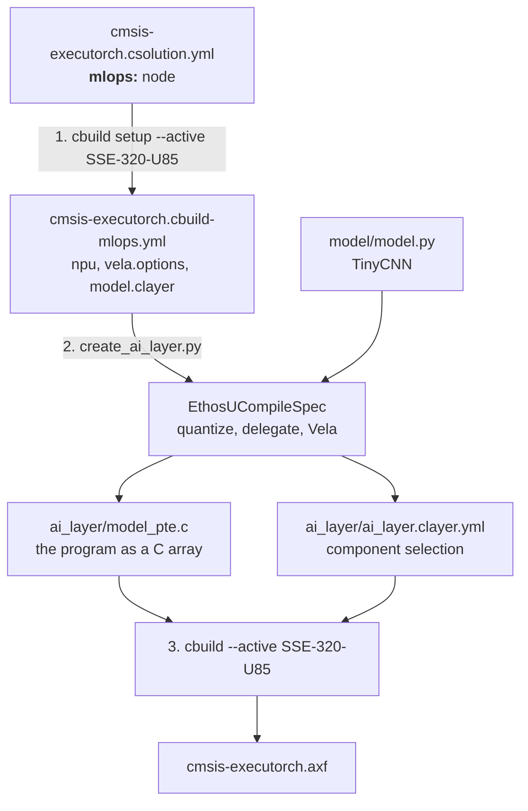

# The MLOps flow

The `mlops:` node in `cmsis-executorch.csolution.yml` is the central
definition of the Ethos-U target for this example. It follows the CMSIS-Toolbox
[MLOps information](https://open-cmsis-pack.github.io/cmsis-toolbox/build-overview/#mlops-information)
specification. This document explains how the three build steps use and
propagate that information.



## 1. `cbuild setup` turns the csolution into `*.cbuild-mlops.yml`

The csolution is the only place where the NPU is described:

```yaml
solution:
  mlops:
    description: TinyCNN int8 image classifier for Ethos-U85
    npu:
      type: Ethos-U85
    vela:
      system: Ethos_U85_SYS_DRAM_Mid   # system-config from the Vela config
      memory: Shared_Sram              # memory-mode from the Vela config
    model:
      clayer: $AI-Layer$
      name: TinyCNN
    simulator:
      target: SSE-320-U85
```

`cbuild setup cmsis-executorch.csolution.yml --active SSE-320-U85`
resolves it for the active target and writes
`cmsis-executorch.cbuild-mlops.yml`:

```yaml
cbuild-mlops:
  generated-by: csolution version 2.14.1+p38-gf512b381
  description: TinyCNN int8 image classifier for Ethos-U85
  processor:
    type: Cortex-M85
  npu:
    type: Ethos-U85
  vela:
    options: --system-config Ethos_U85_SYS_DRAM_Mid --memory-mode Shared_Sram
  model:
    clayer: ai_layer/ai_layer.clayer.yml
    name: TinyCNN
  simulator:
    active: SSE-320-U85
    cbuild-run: out/cmsis-executorch+SSE-320-U85.cbuild-run.yml
    output:
      - file: out/cmsis-executorch/SSE-320-U85/Debug/cmsis-executorch.axf
        type: elf
    model: ${workspaceFolder}/.vscode/fvp.sh
    config-file: board/Corstone-320/fvp_config.txt
```

The SSE-320 device family pack declares no NPU, so `npu:` is written out in
full here. A device pack that does (the Alif Ensemble pack, for one) supplies
the NPU type, the MAC count and its own Vela configuration file, and the
toolbox then also emits `npu.macs`, `vela.ini` and `--accelerator-config`.
The `simulator:` section is what a test runner needs to execute the image
on the FVP; the CMSIS-Toolbox from vcpkg (2.14.1) does not emit it yet, the
Keil Studio extension 1.70.0 does.

This is the hand-over point to the MLOps side: everything a model-export
pipeline needs to know about the target is in this one file, and nothing in it
is specific to this example's Python code.

`cbuild setup` writes the file even when the AI layer does not exist yet, so
the flow also works on a checkout without a generated layer.

## 2. `create_ai_layer.py` turns `*.cbuild-mlops.yml` into the AI layer

`python create_ai_layer.py cmsis-executorch.cbuild-mlops.yml` stands in
for an MLOps system. It reads the file and:

1. builds ExecuTorch's `EthosUCompileSpec` from `npu:` and `vela:` -- the
   accelerator (`ethos-u85-256`), system config and memory mode come from
   there, so the Python code contains no NPU configuration;
2. exports `model/model.py`: quantizes it, delegates the whole graph to the
   Ethos-U and compiles it with Vela;
3. reads the operators the resulting program still calls on the CPU and looks
   up the matching components in the `PyTorch::ExecuTorch` pack (the version
   `cbuild setup` resolved, from `*.cbuild-pack.yml`);
4. writes the layer into the directory of `model.clayer`:

| File | Content |
|------|---------|
| `ai_layer/ai_layer.clayer.yml` | runtime, Ethos-U backend and the operator components the program uses |
| `ai_layer/model_pte.c` / `.h` | the program as a 16-byte-aligned C array, `model_pte` / `model_pte_size` |
| `ai_layer/model.pte` | the program itself, for inspection (not committed) |

For a fully delegated model the component list is short: the runtime, the
Ethos-U backend, and the int8 boundary `quantize` / `dequantize` kernels.
Everything else in the pack is never compiled, let alone linked.

## 3. `cbuild` builds the application

`cbuild cmsis-executorch.csolution.yml --active SSE-320-U85` is a plain
CMSIS build without any Python. The cproject knows nothing about the model: it
lists the application source and the two layers, and the AI layer contributes
both the component selection and the model data.

Because the layer is complete before CMSIS-Toolbox resolves components, a model
change that changes the operator set is just another run of step 2 followed by
step 3.

## Changing the model or the target

- **Another model:** edit `model/model.py`, run steps 2 and 3.
- **Another NPU configuration:** edit the `mlops:` node (and add the matching
  `target-types:` entry and board layer), run steps 1 to 3:

  ```yaml
  mlops:
    npu:
      type: Ethos-U55          # was Ethos-U85
    vela:
      system: Ethos_U55_High_End_Embedded
      memory: Shared_Sram
  ```

  The Python side needs no changes at all.
