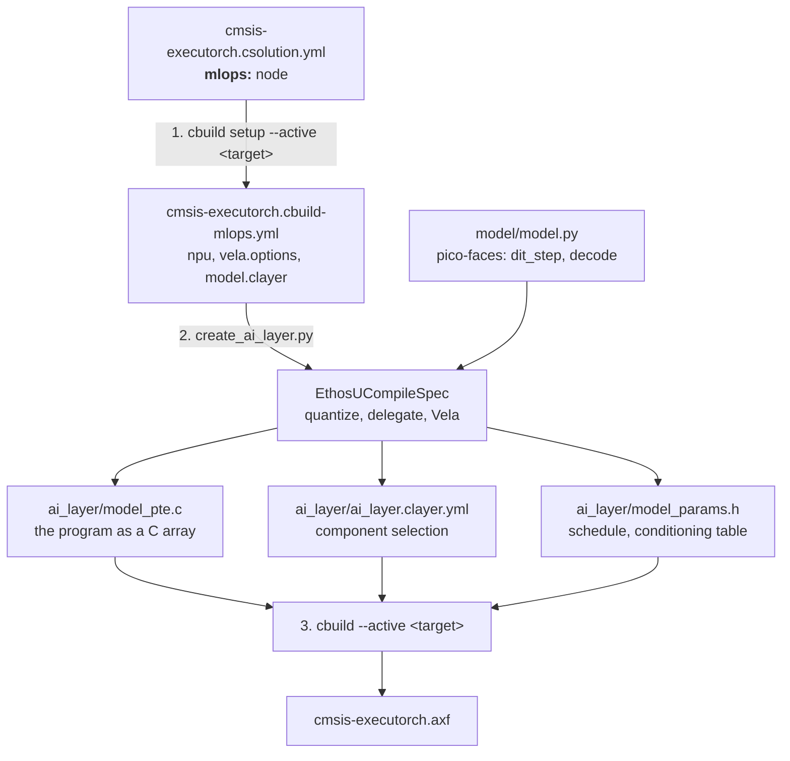

# The MLOps flow

The `mlops:` node in `cmsis-executorch.csolution.yml` is the central
definition of the Ethos-U target for this example. It follows the CMSIS-Toolbox
[MLOps information](https://open-cmsis-pack.github.io/cmsis-toolbox/build-overview/#mlops-information)
specification. This document explains how the three build steps use and
propagate that information.


```mermaid
flowchart TD
    A["cmsis-executorch.csolution.yml<br/><b>mlops:</b> node"] -->|"1. cbuild setup --active &lt;target&gt;"| B["cmsis-executorch.cbuild-mlops.yml<br/>npu, vela.options, model.clayer"]
    B -->|"2. create_ai_layer.py"| C["EthosUCompileSpec<br/>quantize, delegate, Vela"]
    D["model/model.py<br/>pico-faces: dit_step, decode"] --> C
    C --> E["ai_layer/model_pte.c<br/>the program as a C array"]
    C --> F["ai_layer/ai_layer.clayer.yml<br/>component selection"]
    C --> P["ai_layer/model_params.h<br/>schedule, conditioning table"]
    E --> G["3. cbuild --active &lt;target&gt;"]
    F --> G
    P --> G
    G --> H["cmsis-executorch.axf"]
```

## 1. `cbuild setup` turns the csolution into `*.cbuild-mlops.yml`

The csolution is the only place where the NPU is described:

```yaml
solution:
  mlops:
    description: pico-faces rectified-flow face generator for Ethos-U85
    npu:
      type: Ethos-U85
    vela:
      system: Ethos_U85_SRAM_MRAM      # system-config from the Ensemble pack's Vela config
      memory: Shared_Sram              # memory-mode from the Vela config
    model:
      clayer: $AI-Layer$
      name: PicoFaces
    hardware:
      target: DevKit-E8       # <target-type>[@<target-set>] of the board
    simulator:
      target: SSE-320-U85     # <target-type>[@<target-set>] of the FVP
```

`cbuild setup cmsis-executorch.csolution.yml --active DevKit-E8`
resolves it and writes `cmsis-executorch.cbuild-mlops.yml`:

```yaml
cbuild-mlops:
  generated-by: csolution version 2.15.1+p3-gf46d68bf
  description: pico-faces rectified-flow face generator for Ethos-U85
  processor:
    type: Cortex-M55
  npu:
    type: Ethos-U85
    macs: 256
  vela:
    ini: .cmsis/ensemble_vela.ini
    options: --accelerator-config ethos-u85-256 --system-config Ethos_U85_SRAM_MRAM --memory-mode Shared_Sram
  model:
    clayer: ai_layer/ai_layer.clayer.yml
    name: PicoFaces
  hardware:
    active: DevKit-E8
    cbuild-run: out/cmsis-executorch+DevKit-E8.cbuild-run.yml
    output:
      - file: out/cmsis-executorch/DevKit-E8/Debug/cmsis-executorch.axf
        type: elf
  simulator:
    active: SSE-320-U85
    cbuild-run: out/cmsis-executorch+SSE-320-U85.cbuild-run.yml
    output:
      - file: out/cmsis-executorch/SSE-320-U85/Debug/cmsis-executorch.axf
        type: elf
    model: ${workspaceFolder}/.vscode/fvp.sh
    config-file: board/Corstone-320/fvp_config.txt
```

The Ensemble device family pack declares the NPUs of the device and ships a
Vela configuration file, so the toolbox fills in `npu.macs`, copies the file
to `.cmsis/ensemble_vela.ini` and adds `--accelerator-config`. The
`hardware:` and `simulator:` sections are what a test runner needs to load
the image on the board or to execute it on the FVP.

This is the hand-over point to the MLOps side: everything a model-export
pipeline needs to know about the target is in this one file, and nothing in it
is specific to this example's Python code.

`cbuild setup` writes the file even when the AI layer does not exist yet.
Here the clayer and its headers are committed but the 14 MB `model_pte.c` is
not, and csolution refuses a layer whose files are missing: on a fresh
checkout, `touch ai_layer/model_pte.c` first (CI does the same);
`create_ai_layer.py` replaces the placeholder.

## 2. `create_ai_layer.py` turns `*.cbuild-mlops.yml` into the AI layer

`python create_ai_layer.py cmsis-executorch.cbuild-mlops.yml` stands in
for an MLOps system. It reads the file and:

1. builds ExecuTorch's `EthosUCompileSpec` from `npu:` and `vela:` -- the
   accelerator (`ethos-u85-256`), system config and memory mode come from
   there, so the Python code contains no NPU configuration;
2. exports `model/model.py`. The model describes itself through a small
   contract: `get_methods()` lists the methods of the program (here
   `dit_step` and `decode`, each an `nn.Module` with example inputs, a
   calibration data generator and its quantization, `a16w8` or `a8w8`), and
   `get_params()` returns constants for the application. A model with only
   `get_model()` and `get_calibration_inputs()` is exported as the single
   method `forward`. Every method is calibrated on its data (pico-faces:
   latents from real sampling trajectories), delegated to the Ethos-U as a
   whole and compiled with Vela; the script prints the delegate count and the
   operators left on the CPU per method (`AI_LAYER_STRICT=1` turns a partially
   delegated method into an error);
3. reads the operators the resulting program still calls on the CPU and looks
   up the matching components in the `PyTorch::ExecuTorch` pack (the version
   `cbuild setup` resolved for the csolution's pack entry, from
   `*.cbuild-pack.yml`);
4. writes the layer into the directory of `model.clayer`:

| File | Content |
|------|---------|
| `ai_layer/ai_layer.clayer.yml` | runtime, kernel utilities and registration, Ethos-U backend and the operator components the program uses |
| `ai_layer/model_pte.c` / `.h` | the program as a 16-byte-aligned C array in the section `.rodata.model`, `model_pte` / `model_pte_size` |
| `ai_layer/model_params.h` | the constants from `get_params()`: latent and image shapes, the sampling schedule, the guidance strengths and the conditioning table `pf_cond[class][step][128]` |
| `ai_layer/model.pte` | the program itself, for inspection |

The clayer and the headers are committed; `model_pte.c` (a 14 MB C source for
the 2.8 MB program) and `model.pte` are not, so a fresh checkout runs step 2
once before it builds. For a fully delegated model the component list is
short: `Runtime`, `Kernel Utils`, `Kernel Registration`, `Backend EthosU`,
and the boundary `Quantized quantize` / `Quantized dequantize` operators
(they handle 8- and 16-bit activations). Everything else in the pack is never
compiled, let alone linked.

The program holds two methods; the application loads both once and runs them
in a loop (`src/app_main.cpp`): the Euler sampler and the classifier-free
guidance blend are a few thousand float operations on the Cortex-M,
everything else is NPU work.

## 3. `cbuild` builds the application

`cbuild cmsis-executorch.csolution.yml --active SSE-320-U85` is a plain
CMSIS build without any Python. The cproject knows nothing about the model: it
lists the application source and the two layers, and the AI layer contributes
both the component selection and the model data.

Because the layer is complete before CMSIS-Toolbox resolves components, a model
change that changes the operator set is just another run of step 2 followed by
step 3.

## Changing the model or the target

- **Another model:** edit `model/model.py` (`get_methods()`, or `get_model()`
  and `get_calibration_inputs()` for a single method), adapt the runner in
  `src/app_main.cpp`, run steps 2 and 3.
- **Another precision:** `PICO_FACES_QUANT=a8w8 python create_ai_layer.py ...`
  exports the DiT with 8-bit activations (smaller SRAM footprint, visibly
  worse faces); `model/verify_export.py --stage fakequant` shows the effect on
  the host before a build.
- **Another NPU configuration:** edit the `mlops:` node (and add the matching
  `target-types:` entry and board layer), run steps 1 to 3:

  ```yaml
  mlops:
    npu:
      type: Ethos-U55          # was Ethos-U85
    vela:
      system: Ethos_U55_High_End_Embedded
      memory: Shared_Sram
  ```

  The Python side needs no changes at all.
